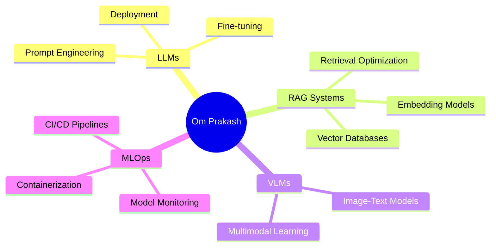

<div align="center">
  
# 👋 Hi, I'm Om Prakash Rout

### 🤖 Machine Learning Engineer | 🔬 AI Researcher | 🎓 CS Undergrad

<p align="center">
  <em>Specializing in LLMs, RAG Systems, and ML Operations</em>
</p>

[](https://www.linkedin.com/in/omprakash-rout-88020522b/)
[](mailto:omprakashrouttt1@gmail.com)
[](https://github.com/omprakashrouttt)

</div>

---

## 🚀 About Me

```python
class OmPrakashRout:
    def __init__(self):
        self.role = "Machine Learning Engineer"
        self.education = "B.Tech in Computer Science (3rd Year)"
        self.current_focus = ["LLMs", "Vision Language Models", "MLOps"]
        self.research = {
            "current": "IIT Roorkee",
            "previous": "IIT Bhubaneswar"
        }
        self.interests = ["RAG Systems", "NLP", "Computer Vision"]
    
    def say_hi(self):
        print("Thanks for stopping by! Let's build something amazing together!")

me = OmPrakashRout()
me.say_hi()
```

🎓 **3rd Year Computer Science Student** passionate about advancing AI through research and practical applications

🔬 **Researcher at IIT Roorkee** | **Ex-Researcher at IIT Bhubaneswar**

🌱 Currently diving deep into **Vision Language Models (VLMs)** and **ML Operations**

💡 Building production-ready ML systems with focus on **LLMs** and **RAG architectures**

---

## 🛠️ Tech Stack

<div align="center">

### Languages & Frameworks


### Machine Learning & AI


### LLM & RAG Stack


### MLOps & Tools


</div>

---

## 📊 GitHub Stats

<div align="center">
  
  
</div>

<div align="center">
  
</div>

---

## 🔥 Featured Projects

<div align="center">

[](https://github.com/omprakashrouttt/Sentiment_analysis-model)
[](https://github.com/omprakashrouttt/Find-my-campus)

</div>

---

## 🌟 Current Focus Areas



---

## 📈 Activity Graph

<div align="center">
  
</div>

---

## 💼 Research & Collaboration

🔬 **Open to collaborations** in:
- Large Language Model applications
- RAG system development
- ML pipeline optimization
- Research projects in NLP/CV

📫 **Reach out for**:
- Research opportunities
- ML project collaborations
- Tech discussions

---

<div align="center">

### 💭 Random Dev Quote


---

### 👀 Profile Views


<sub>⭐️ From [omprakashrouttt](https://github.com/omprakashrouttt)</sub>

</div>
